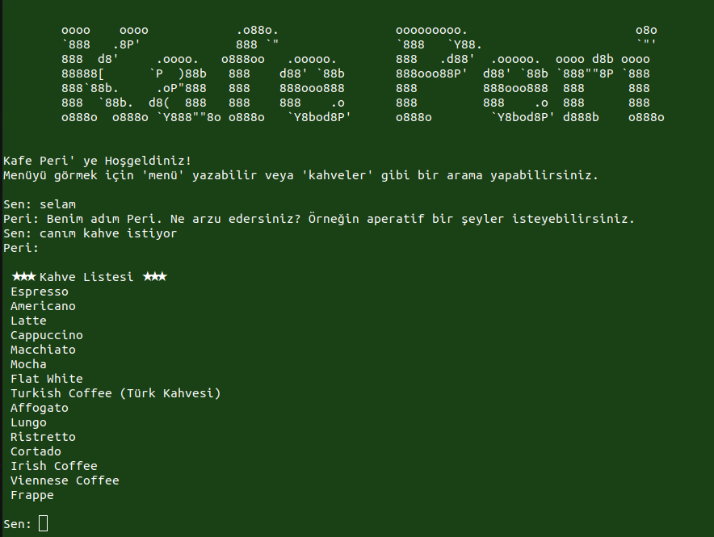

# PeriChatbot

PeriChatbot, Türkçe doğal dil işleme tekniklerini kullanan bir Python uygulamasıdır. Bu sohbet botu, kullanıcının girdiğini analiz ederek uygun bir yanıt üretir.

## Örnek

Aşağıdaki örnekte, PeriChatbot'un çalıştırılmasına ilişkin bir ekran görüntüsü bulunmaktadır:



## Kurulum

1. Bu depoyu klonlayın veya ZIP olarak indirin.
2. Bu projeyi çalıştırmak için aşağıdaki Python kütüphanelerini yüklemeniz gerekir:
- `json`: JSON verilerini okumak için.
- `nltk`: Doğal dil işleme işlemleri için.
- `scikit-learn`: Metin vektörizasyonu ve benzerlik hesaplamaları için.
- `numpy`: Matematiksel işlemler yapmak için.
- `snowballstemmer`: Türkçe metinlerde kök bulmak için.

3. `veriler.json` dosyasını projenizin kök dizinine ekleyin. Bu dosya, sohbet botunun eğitim verilerini içerir.

## Kullanım

1. Python'u kullanarak `main.py` dosyasını çalıştırın:

    ```
    python main.py
    ```

2. Program başladığında, bir hoş geldiniz mesajıyla karşılanacaksınız.
3. Ardından, sohbet botu size yanıt verebileceği bir şeyler sorabilir.
4. İlgili bir giriş yapın ve botun yanıtını gözlemleyin.
